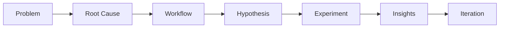

# 🧠 PM Study Calendar

A system-driven **Product Management learning tracker** to build consistency, track progress, and structure daily PM preparation.

---

## 🚀 Features
- 📅 Calendar-based task tracking  
- 🧩 Structured PM learning (theory, skills, AI, problem-solving)  
- ✅ Daily task completion & notes  
- 📊 Progress tracking & insights  

---

## 🧠 Framework

---

## 🤖 Built with AI Assistance

This project was developed using AI-assisted coding (Claude), where I:

- Defined the product requirements and system design  
- Structured workflows and user experience  
- Iterated on features using a problem-first approach  

AI was used as a tool — the product thinking, logic, and structure were driven by me.

---

## 🎯 Goal

Help aspiring PMs turn learning into a structured system, not random effort.

---

